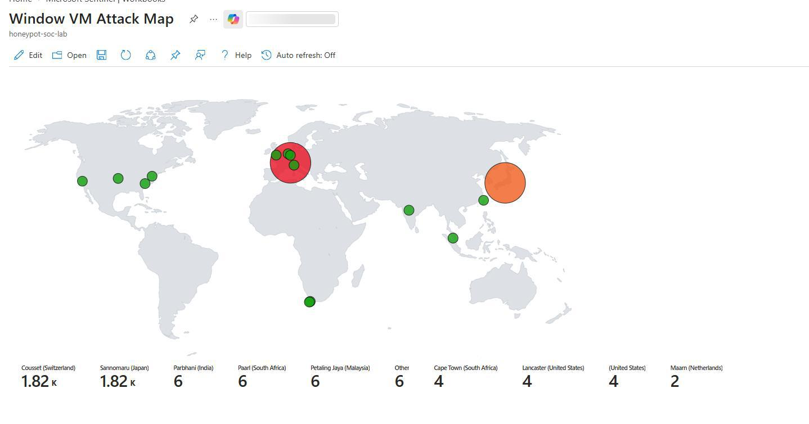
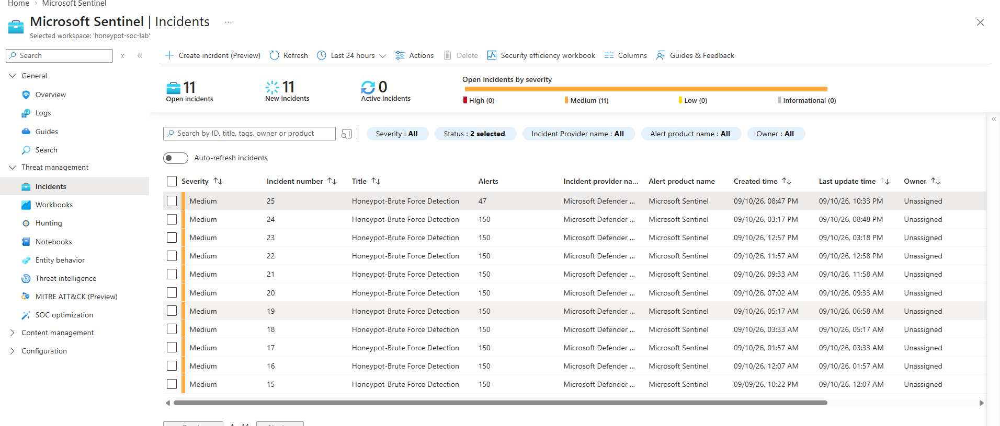

# Live Honeypot SOC Lab: Catching Real Attackers with Azure and Sentinel

## What This Is

A honeypot SIEM lab where I deployed a Windows VM deliberately exposed to the open internet, forwarded its logs into Microsoft Sentinel, and built detection rules to catch real, unsimulated attack traffic. I also built a live map showing where in the world the attacks were actually coming from. The full step-by-step walkthrough, including exact KQL queries and line-by-line explanations, is in the [full writeup](full-writeup.md).

## Architecture

```text
Public Internet (real attackers)
            ↓
Exposed Azure VM (Windows, firewalls disabled)
            ↓
Azure Monitor Agent + Data Collection Rule
            ↓
Log Analytics Workspace
            ↓
Microsoft Sentinel (SIEM)
            ↓
4x KQL Detection Rules + Geolocation Watchlist
            ↓
Incidents + Live Attacker Map
```

## What I Built

- A resource group, virtual network, and VM configured as a public-facing honeypot
- A network security group rule allowing all inbound traffic, plus a disabled internal Windows Firewall, to make the VM as attractive to attackers as possible
- A Log Analytics Workspace connected to Microsoft Sentinel, with logs forwarded via the Azure Monitor Agent
- Four scheduled detection rules, each mapped to a different MITRE ATT&CK tactic:

  | Rule | Tactic | Technique | Severity |
  | --- | --- | --- | --- |
  | Brute Force Detection | Credential Access | T1110 | Medium |
  | Suspicious Process After Login | Execution | T1059 | Medium |
  | New Local User Account Created | Persistence | T1136.001 | Medium |
  | Security Event Log Cleared | Defense Evasion | T1070.001 | High |

- A geolocation watchlist that resolves attacker IP addresses to city/country data
- A Sentinel workbook visualizing every attack on a live map

## Result

After leaving the VM exposed to the internet for 24 hours, it attracted real attack traffic from multiple locations worldwide. The brute force detection rule fired against this live traffic and generated an actual incident in Sentinel, confirming the full pipeline works end to end: exposure → logging → detection → alerting. Deep investigation of that incident was kept out of scope for this lab.



*Live attacker map after 24 hours: real attack traffic from Vietnam, the US, South Africa, Malaysia, India, the UK, Italy, and more*



*The brute force detection rule fired against real traffic, generating an actual incident in Sentinel*

## Skills Demonstrated

- Azure infrastructure setup (resource groups, virtual networks, NSGs, VMs)
- Deliberate attack-surface exposure for controlled security research
- Log pipeline configuration (Azure Monitor Agent, Data Collection Rules, Log Analytics)
- KQL query writing across multiple detection patterns, including joins and time-window correlation
- MITRE ATT&CK mapping across four different tactics
- Watchlist-based enrichment (IP-to-geolocation lookups)
- Data visualization (Sentinel workbooks)
- Honest identification of detection blind spots (e.g. log-clearing evasion)

## Tools Used

Microsoft Azure, Microsoft Sentinel, Log Analytics Workspace, Azure Monitor Agent, KQL, Sentinel Workbooks

## Full Documentation

See the [full writeup](docs/full-writeup.md) for the complete walkthrough, including every KQL query with a line-by-line explanation, the reasoning behind each severity rating, and troubleshooting notes.

- [`docs/full-writeup.md`](full-writeup.md): the full step-by-step writeup with all screenshots
- [`docs/Honeypot-SIEM-Lab-Documentation.pdf`](Honeypot-SIEM-Lab-Documentation.pdf): the same writeup as a PDF, for downloading and reading later
- [`images/`](images/): screenshots used in the README and the full writeup
