# Live Honeypot SOC Lab: Catching Real Attackers with Azure and Sentinel

> A PDF copy of this writeup is available for offline reading: [Honeypot-SIEM-Lab-Documentation.pdf](Honeypot-SIEM-Lab-Documentation.pdf). For a short overview, see the [README](../README.md).

## Table of Contents

1. [What This Lab Is About](#1-what-this-lab-is-about)
2. [Building the Environment](#2-building-the-environment)
3. [Opening the Firewall (On Purpose)](#3-opening-the-firewall-on-purpose)
4. [Preparing the VM as a Honeypot](#4-preparing-the-vm-as-a-honeypot)
5. [Setting Up Log Collection](#5-setting-up-log-collection)
6. [Confirming Log Ingestion](#6-confirming-log-ingestion)
7. [First Look at the Logs](#7-first-look-at-the-logs)
8. [Building the Detection Rules](#8-building-the-detection-rules)
9. [Mapping Attackers to Real-World Locations](#9-mapping-attackers-to-real-world-locations)
10. [Building the Attacker Map](#10-building-the-attacker-map)
11. [Results](#11-results)
12. [What This Project Taught Me](#12-what-this-project-taught-me)
13. [Summary](#13-summary)
14. [Resources](#14-resources)

## Detection Rules at a Glance

| Rule | Tactic | Technique | Severity |
| --- | --- | --- | --- |
| Brute Force Detection | Credential Access | T1110 | Medium |
| Suspicious Process After Login | Execution | T1059 | Medium |
| New Local User Account Created | Persistence | T1136.001 | Medium |
| Security Event Log Cleared | Defense Evasion | T1070.001 | High |

## 1. What This Lab Is About

This lab is a basic SOC build, not just a config walkthrough. I created a honeypot in Azure: a Windows VM deliberately exposed to the public internet with its firewalls turned off, so that real attackers on the internet would find it and try to break in. I forwarded its logs into a central repository, wrote detection rules to catch specific attack behaviors, and built a map to visualize where the attacks were actually coming from.

The point of this lab isn't really the honeypot itself. It's to see, first-hand, how fast and how often a system gets attacked the moment it's exposed to the internet with no protection.

Every attack in this lab is real and came from the live internet, not simulated.

**The route I took:**

```text
Create Resource Group
→ Create Virtual Network
→ Create Virtual Machine
→ Edit Network Security Group
→ Configure new inbound rule
→ Log in to the Windows VM
→ Turn off the firewall in the Windows VM
→ Create a Log Analytics Workspace
→ Connect the Log Analytics Workspace to Sentinel
→ Install and configure the Azure Monitor Agent
→ Configure detection rules
→ Upload geolocation data
→ Create the attacker map
```

## 2. Building the Environment

### Resource Group: `Sentinel-RG`

Everything in this lab lives inside one resource group, so the VM, virtual network, and every other resource created for this lab stay grouped together.

### Virtual Network

Next I created a virtual network. This gives the honeypot VM a network environment to sit inside and communicate through. After creating it, I checked the resource group to confirm it showed up there, which it did.

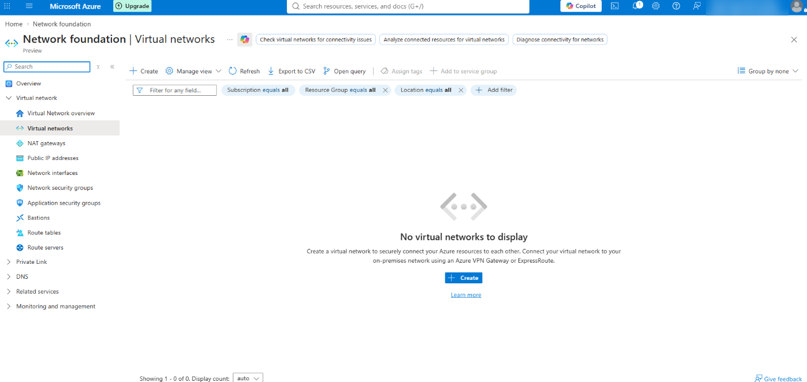

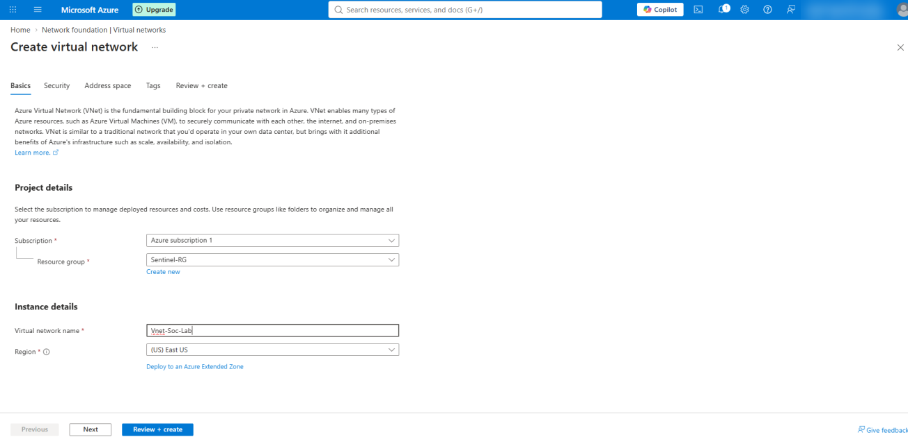

*Creating the virtual network inside Sentinel-RG*

### Virtual Machine

This is the actual honeypot: the VM that's meant to get attacked. Creating it also automatically created a few supporting resources inside the resource group:

- A public IP address, so the VM is reachable from the internet
- A network security group (NSG), which acts as the firewall sitting in front of the VM
- A network interface, which works like the VM's virtual ethernet port
- A disk, for the VM's storage

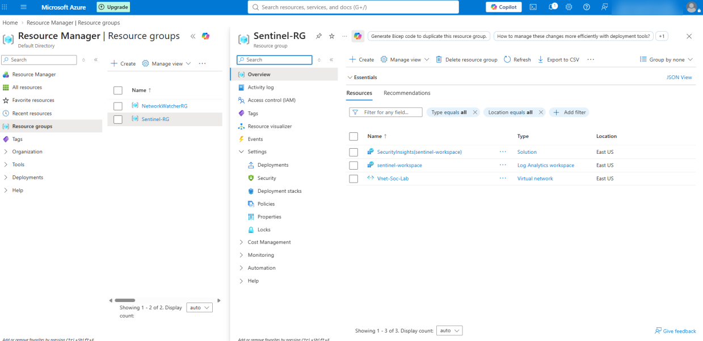

*Sentinel-RG showing the virtual network and Log Analytics workspace*

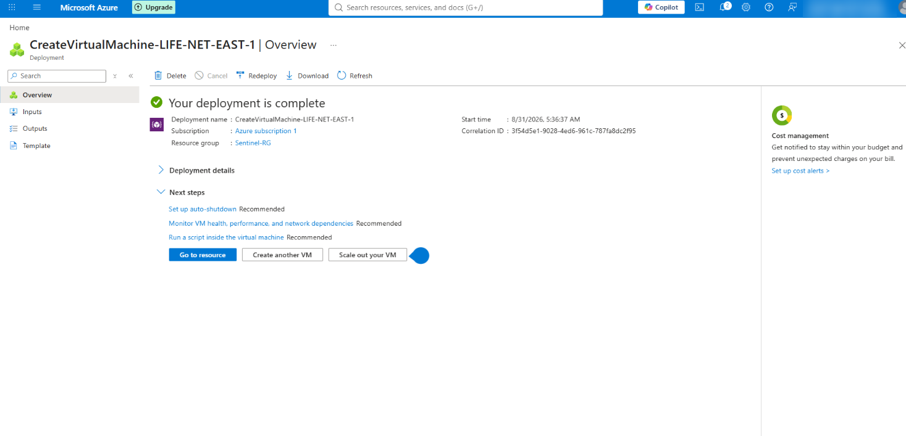

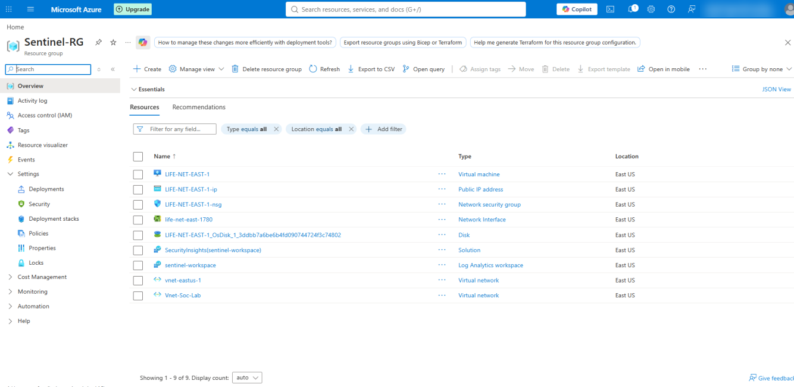

*VM deployment complete, with all supporting resources created in Sentinel-RG*

## 3. Opening the Firewall (On Purpose)

The network security group is what sits between the VM and the public internet. **Inbound rules** control what traffic is allowed *into* the virtual network from the internet, and **outbound rules** control what's allowed *out*.

To make the honeypot actually attractive to attackers, I deleted the default RDP-only inbound rule and replaced it with my own rule, named `Danger_AllowAnyInbound`, which allows any type of traffic in. In the real world this would be a serious misconfiguration, but for this lab it's the entire point: the VM needs to look wide open for anything to find and attack it.

I set the rule's priority to 100. In Azure NSG rules, a lower priority number means the rule is evaluated sooner. Since there were only a few rules total with plenty of room between their priority numbers, 100 was fine here.

Azure threw several warnings after this change, since I was allowing any traffic inbound. That's expected and not something to panic over, it's Azure correctly flagging that this is an unusual and risky configuration.

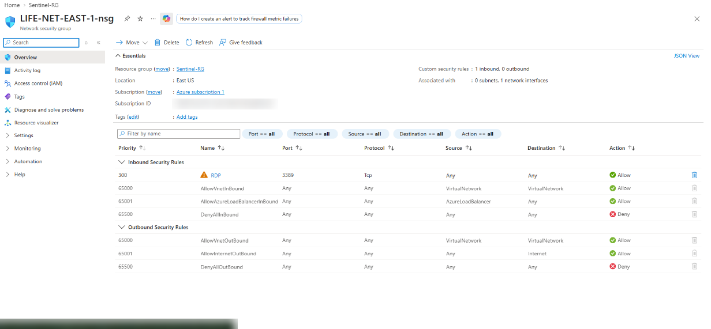

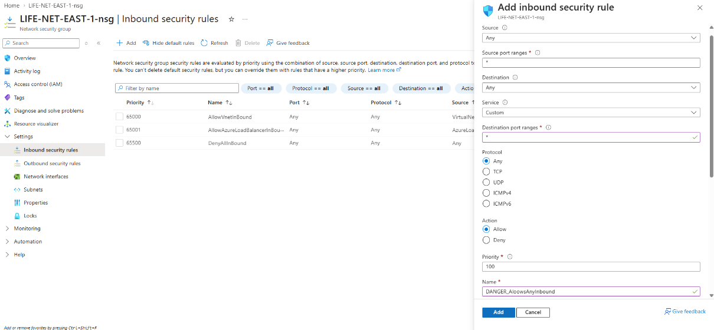

*Inbound security rules, including the new Danger_AllowAnyInbound rule*

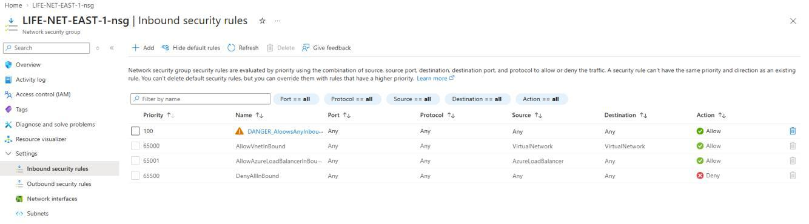

*Confirming the new inbound rule is active*

## 4. Preparing the VM as a Honeypot

To make the VM vulnerable at the OS level too, not just the network level, I needed to log in and disable its internal Windows Firewall.

1. Copied the VM's public IP address from the Azure portal.
2. Opened Remote Desktop Connection on my local machine and connected using that IP address, along with the username and password set when the VM was created.
3. Once logged in, opened Windows Defender Firewall, turned it off for every network profile tab, and clicked Apply.

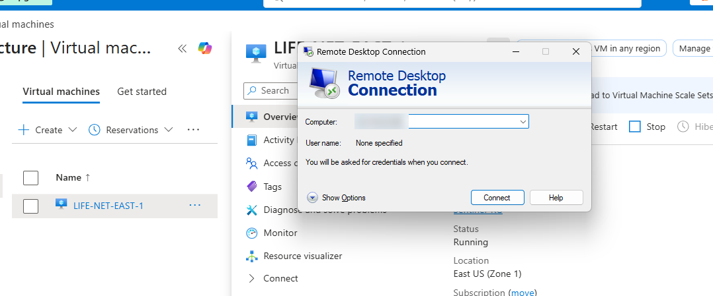

*Connecting to the VM via Remote Desktop*

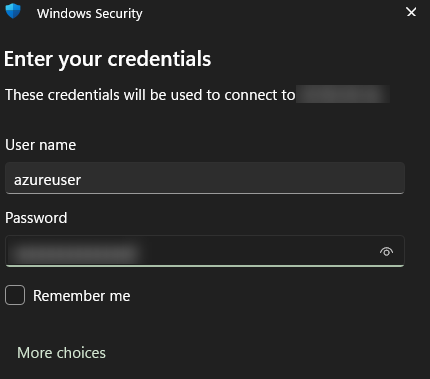


*Logged into the honeypot VM's desktop*

### Confirming the VM was actually reachable from the internet

To check that the VM would actually be visible to attackers, I pinged it from my own computer:

```text
ping -l 64 <VM_PUBLIC_IP>
```

`-l 64` sets the ping packet size to 64 bytes, and the IP address is the VM's public IP copied from Azure. Getting a response back confirmed the VM was reachable, which meant that if I could reach it, attackers scanning the internet could too.

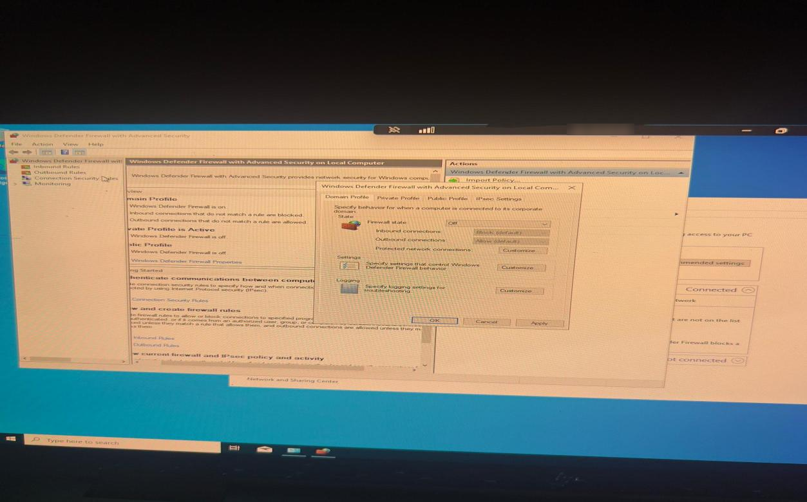

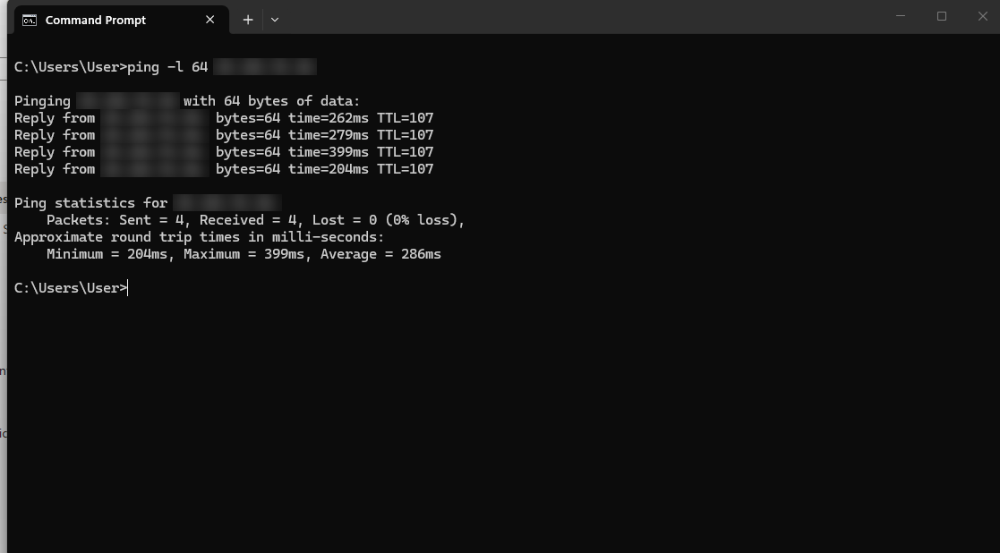

*Successful ping response from the exposed VM*

## 5. Setting Up Log Collection

With the VM exposed, I needed a way to actually capture what was happening to it.

I created a Log Analytics Workspace, which acts as the log repository, and connected it to Microsoft Sentinel so I could view and query the logs. It's technically possible to view security events directly in the VM's own Windows Event Viewer, but Sentinel is far easier to work with, especially for querying and filtering across a large volume of events.

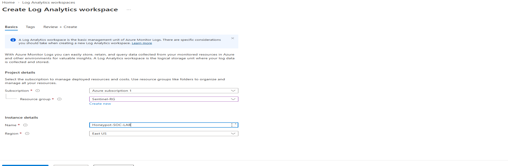

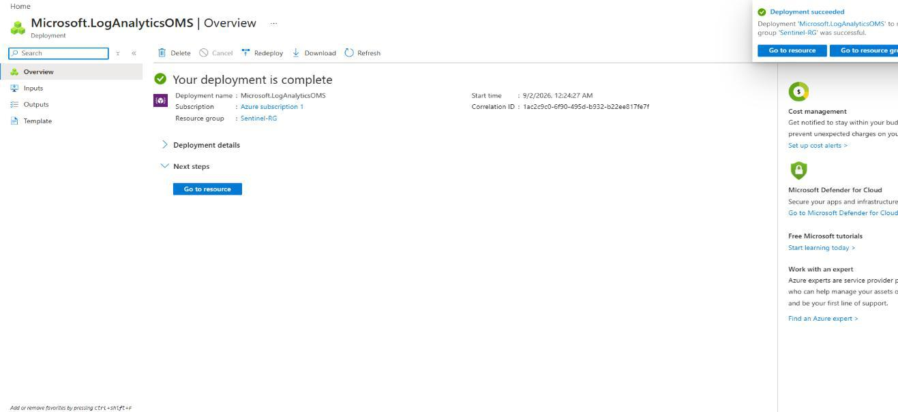

*Log Analytics Workspace created successfully*

Next, I configured the Azure Monitor Agent to actually get logs flowing from the VM into the workspace:

1. Went to the Content Hub in Sentinel, searched for Windows Security Events, and installed it.
2. Inside that solution, created a Data Collection Rule (DCR). This is what tells the VM which logs to collect and where to forward them, in this case, into the Log Analytics Workspace so they'd be accessible inside Sentinel.

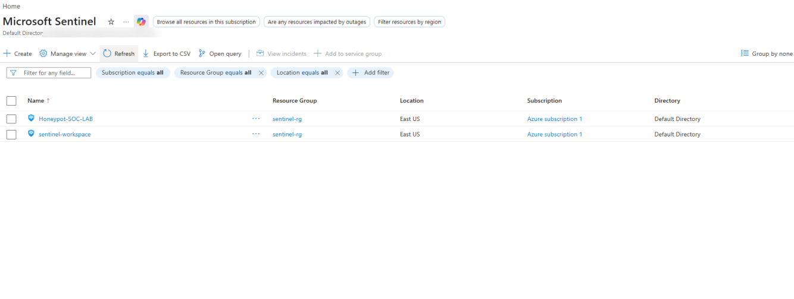

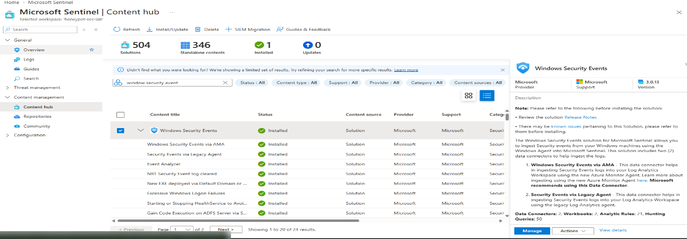

*Installing the Windows Security Events solution from the Content Hub*

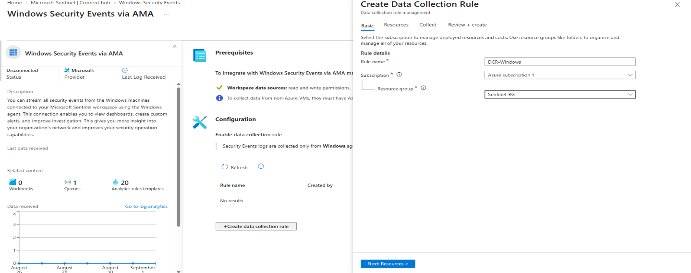

*Creating the Data Collection Rule and confirming the Azure Monitor Agent extension on the VM*

## 6. Confirming Log Ingestion

Back in the Log Analytics Workspace, I ran a basic query against the `SecurityEvent` table to check if any logs had come in yet. Nothing showed up at first.

That didn't mean anything was broken. Everything had just been created moments earlier, and log ingestion takes time to start flowing. After waiting around 20 minutes and checking again, logs were showing up as expected.

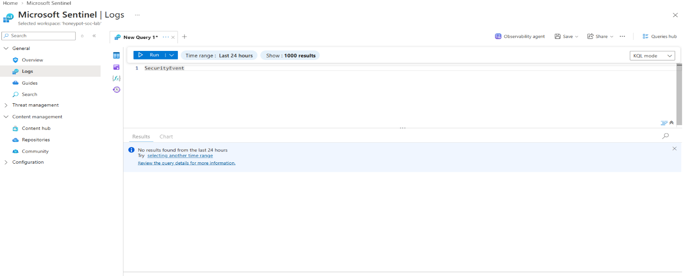

*No results yet, moments after setup*

**Lesson carried over from my other Sentinel lab:** a missing log right after setup is almost always an ingestion delay, not a broken connector. Worth checking again after a wait before assuming something's misconfigured.

## 7. First Look at the Logs

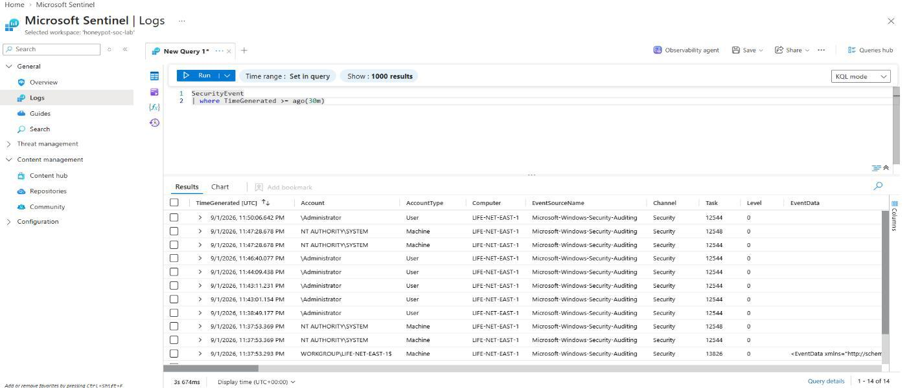

*Logs flowing in after the ingestion delay*

With logs flowing, I ran a few exploratory queries to see what the honeypot was picking up, including checking the total number of failed logon attempts recorded so far.

I also pulled the IP address of one of the attackers and ran it through an IP lookup website. It resolved to Ho Chi Minh City, Vietnam. I want to be careful about what that actually proves: it tells you where the connection *appeared* to originate from, not necessarily where the attacker physically is, since VPNs and other location-masking tools are common. Digging into attacker attribution wasn't the goal of this lab, so I left that as a possible follow-up rather than chasing it here.

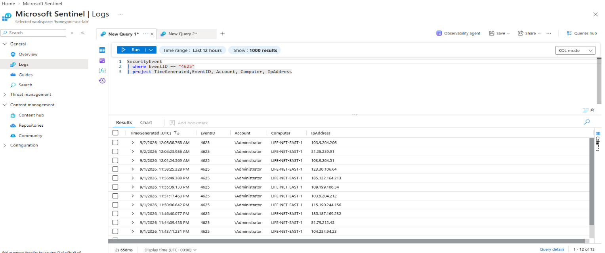

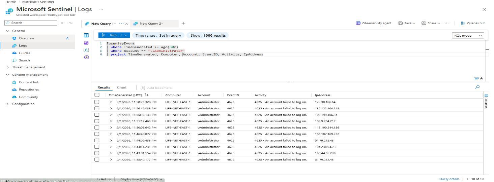

*Failed logon events recorded by the honeypot*

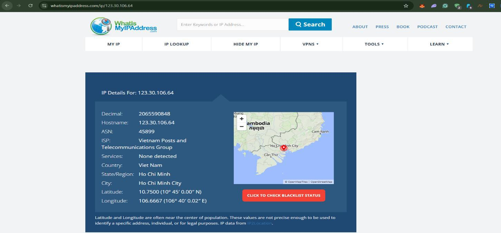

*IP lookup showing the attacker's apparent location: Ho Chi Minh City, Vietnam*

## 8. Building the Detection Rules

I built four detection rules, each mapped to a different MITRE ATT&CK tactic: Credential Access, Execution, Persistence, and Defense Evasion. All four were created the same way:

```text
Microsoft Sentinel → Analytics → Create → Scheduled query rule
```

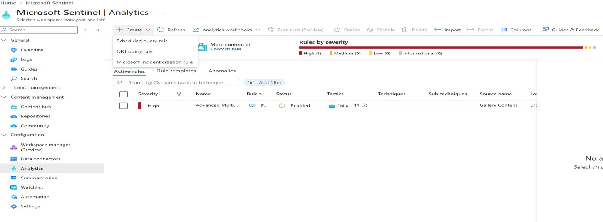

*Creating a new scheduled query rule in Microsoft Sentinel*

### Rule 1: Brute Force Detection

- Name: Honeypot - Brute Force Detection
- Severity: Medium
- MITRE ATT&CK: Credential Access → Brute Force (T1110)
- Query scheduling: runs every 5 minutes, looking back over the last 2 hours
- Alert threshold: greater than 1

```kusto
SecurityEvent
| where EventID == 4625  // failed logon
| summarize FailedAttempts = count() by IPAddress, Account
| where FailedAttempts > 5
```

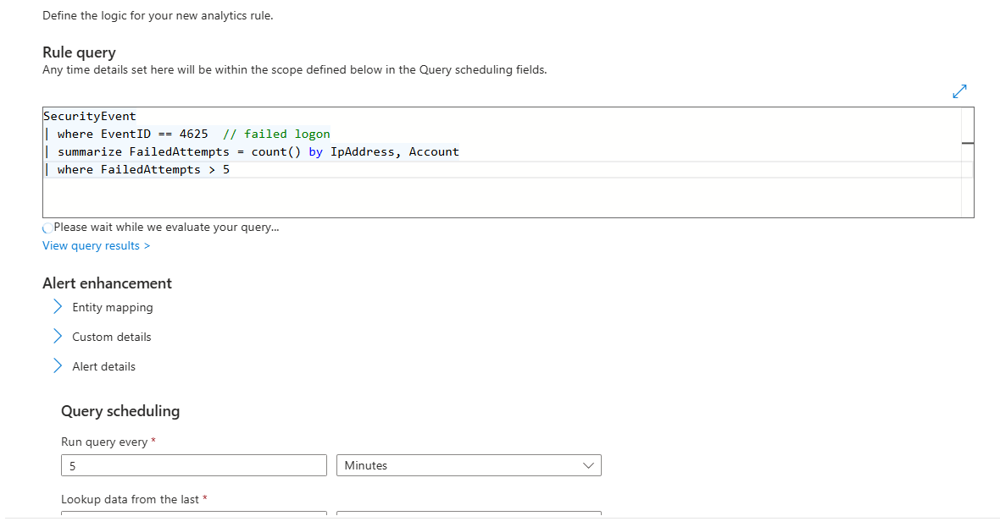

*Rule 1 query configured in the analytics rule wizard*

**Line by line:**

- `SecurityEvent`: the Windows Security event table, populated by the Azure Monitor Agent.
- `| where EventID == 4625`: filters down to only failed logon events. This is the standard Windows event ID for a failed login.
- `| summarize FailedAttempts = count() by IPAddress, Account`: groups the failed attempts by the source IP address and the account being targeted, then counts how many failed attempts each IP/account pair has.
- `| where FailedAttempts > 5`: filters that grouped result down to pairs with more than 5 failed attempts, which is the actual brute force threshold.

**Why Medium severity:** a failed login attempt alone hasn't compromised anything yet, it's suspicious activity worth investigating, not confirmed impact. Brute force *attempts* sit at Medium; brute force *followed by a success* would be a stronger, High-severity signal. This is a good reminder that severity isn't just about the technique being detected, it's about impact and confidence.

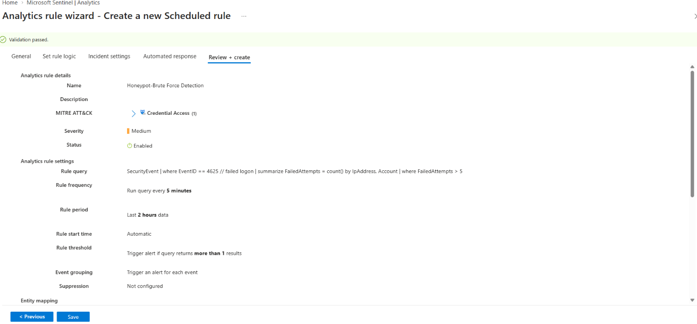

*Rule 1 review and create summary*

### Rule 2: Suspicious Process After Login

- Name: Honeypot - Suspicious Process After Login
- Severity: Medium
- MITRE ATT&CK: Execution → Command and Scripting Interpreter (T1059)

```kusto
let Logons = SecurityEvent
| where EventID == 4624
| project LogonTime = TimeGenerated, Account, Computer, LogonId;
let SuspiciousProcs = SecurityEvent
| where EventID == 4688
| where NewProcessName has_any ("cmd.exe", "powershell.exe")
| project ProcTime = TimeGenerated, Account, Computer, NewProcessName;
Logons
| join kind=inner SuspiciousProcs on Account, Computer
| where ProcTime between (LogonTime .. LogonTime + 10m)
| project LogonTime, ProcTime, Account, Computer, NewProcessName
```

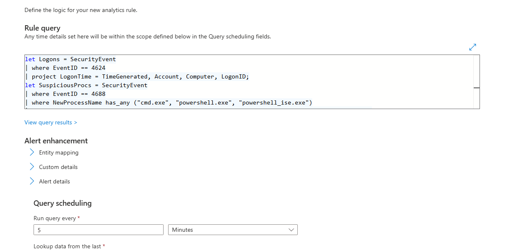

*Rule 2 query configured in the analytics rule wizard*

**Line by line:**

- `let Logons = ...`: builds a temporary table of successful logon events (Event ID 4624), keeping the time, account, computer, and logon ID.
- `let SuspiciousProcs = ...`: builds a second temporary table of process creation events (Event ID 4688), filtered to just `cmd.exe` or `powershell.exe`.
- `Logons | join kind=inner SuspiciousProcs on Account, Computer`: matches logon events to process events that happened on the same account and computer.
- `| where ProcTime between (LogonTime .. LogonTime + 10m)`: narrows the match down to processes that started within 10 minutes *after* the logon. This is what turns "someone used PowerShell" into "someone used PowerShell right after logging in," a much stronger and more specific signal than either event alone.
- `| project ...`: keeps only the fields worth seeing in the alert.

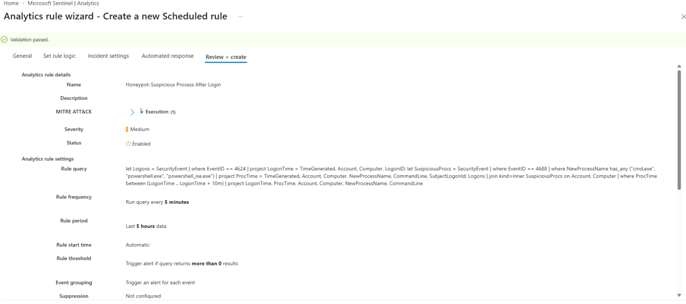

*Rule 2 review and create summary*

### Rule 3: New Local User Account Created

- Name: Honeypot - New Local User Account Created
- Severity: Medium
- MITRE ATT&CK: Persistence → Create Account (T1136), sub-technique T1136.001 (Local Account)
- Alert threshold: greater than 0

```kusto
SecurityEvent
| where EventID == 4720
| project TimeGenerated, Computer, NewAccount = TargetUserName, CreatedBy = SubjectUserName
```

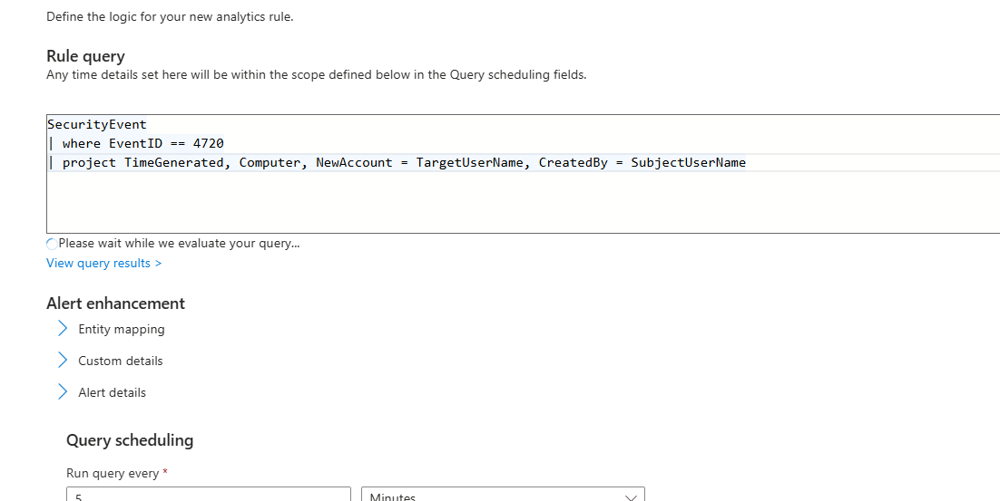

*Rule 3 query configured in the analytics rule wizard*

**Line by line:**

- `| where EventID == 4720`: filters to "a user account was created" events, the Windows event ID for local account creation.
- `| project TimeGenerated, Computer, NewAccount = TargetUserName, CreatedBy = SubjectUserName`: renames the raw fields to something readable, the account that got created, and who created it.

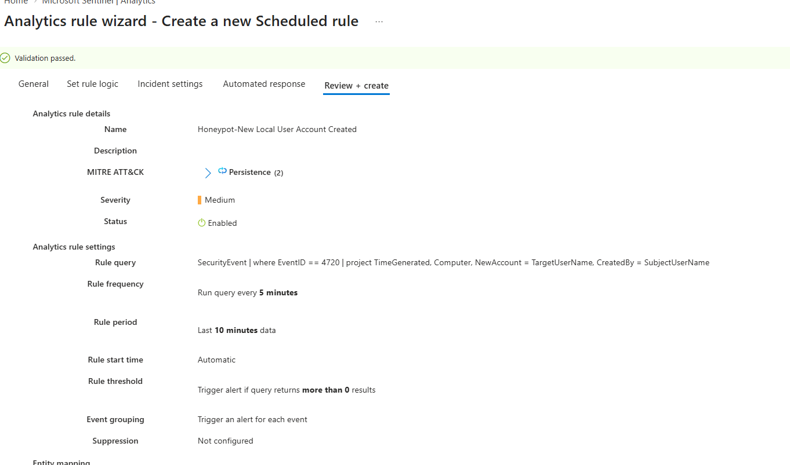

*Rule 3 review and create summary*

**Why Medium severity:** creating a local account isn't inherently malicious on its own (admins do it too), but on a honeypot with zero legitimate admin activity, any new account is automatically worth flagging.

Unlike the brute force rule, which needs a numeric threshold to separate normal typos from an actual attack, this rule fires on any single match. Not every detection needs a count-based threshold, some events are rare and specific enough that one occurrence is meaningful on its own.

### Rule 4: Security Event Log Cleared

- Name: Honeypot - Security Event Log Cleared
- Severity: High
- MITRE ATT&CK: Defense Evasion → Indicator Removal (T1070), sub-technique T1070.001 (Clear Windows Event Logs)
- Alert threshold: greater than 0

```kusto
SecurityEvent
| where EventID == 1102
| project TimeGenerated, Computer, ClearedBy = SubjectUserName
```

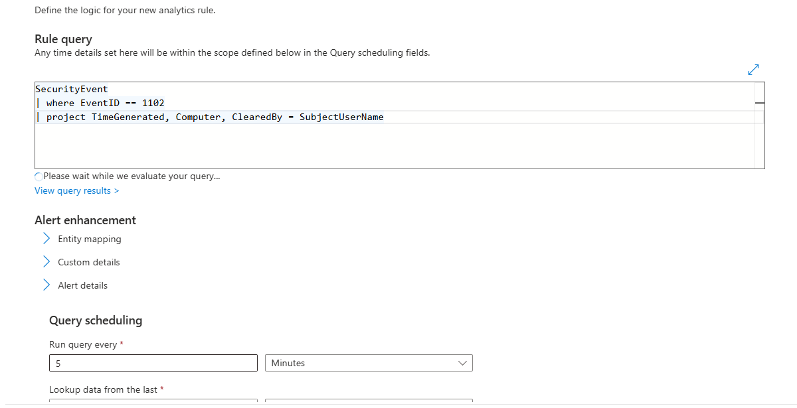

*Rule 4 query configured in the analytics rule wizard*

**Line by line:**

- `| where EventID == 1102`: filters to the specific event logged when the Windows Security audit log itself is cleared.
- `| project TimeGenerated, Computer, ClearedBy = SubjectUserName`: keeps the time, machine, and who triggered it.

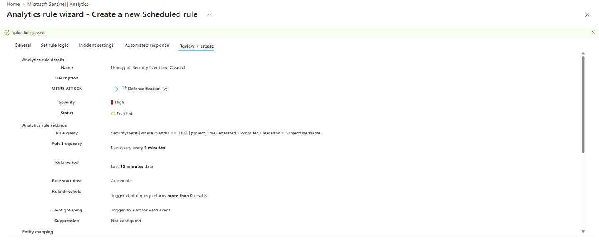

*Rule 4 review and create summary*

**Why High severity:** clearing the event log is almost never something a legitimate process on a honeypot would do. It's a classic sign that someone is actively trying to cover their tracks after doing something else first, which makes it a stronger, more confident signal than the other three rules.

**A limitation worth being honest about:** if an attacker successfully clears the log before this rule's next scheduled run, the very event that would have triggered the alert can get wiped along with everything else. That's a real gap in log-based detection: detecting a technique isn't the same as being resilient against it. A more mature setup would forward logs somewhere tamper-resistant, in closer to real time, which is a reasonable next step for this lab.

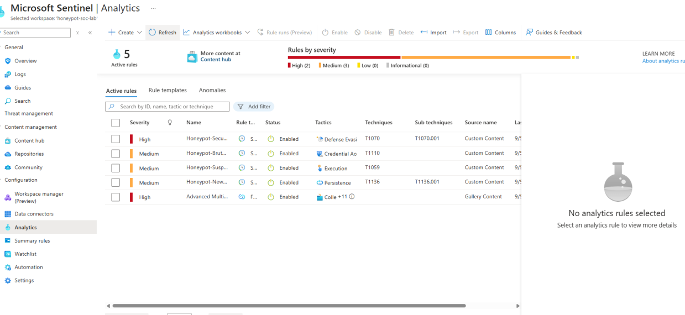

*All four detection rules active in Microsoft Sentinel, alongside the built-in Advanced Multistage rule*

## 9. Mapping Attackers to Real-World Locations

Knowing an attacker's IP address is useful, but seeing *where* attacks are coming from on a map makes the pattern much easier to understand at a glance. To do that, I needed to resolve IP addresses to geographic locations.

### Setting up the geolocation data

I downloaded a geolocation dataset that maps IP address ranges to latitude, longitude, city, and country, and uploaded it into Sentinel as a watchlist:

```text
Sentinel → Configuration → Watchlists → Create new watchlist
→ filled in name and alias
→ uploaded the file
→ Review
→ Create
```

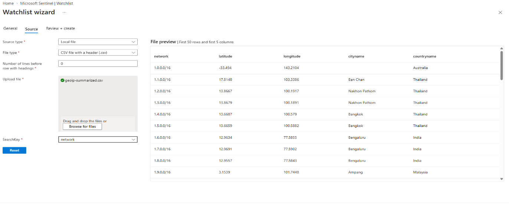

*Uploading the geolocation dataset as a Sentinel watchlist*

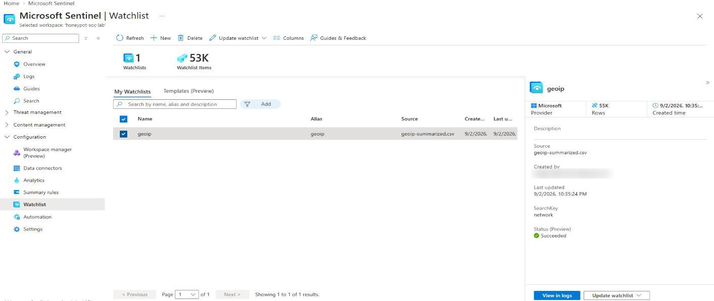

*The geoip watchlist, holding 53K rows*

The idea is that for any attacker IP address, Sentinel can check which range it falls into in this dataset and pull out the matching location.

### Confirming the lookup worked

```kusto
let GeoIPDB_FULL = _GetWatchlist("geoip");
SecurityEvent
| where EventID == 4625
| order by TimeGenerated desc
| evaluate ipv4_lookup(GeoIPDB_FULL, IPAddress, network)
| project TimeGenerated, Computer, AttackerIp = IPAddress, cityname, countryname
```

**Line by line:**

- `let GeoIPDB_FULL = _GetWatchlist("geoip")`: loads the uploaded geolocation watchlist into a variable so it can be referenced in the query.
- `| where EventID == 4625`: narrows to failed logon events, same as the brute force rule.
- `| order by TimeGenerated desc`: sorts the results with the most recent event first.
- `| evaluate ipv4_lookup(GeoIPDB_FULL, IPAddress, network)`: this is the actual geolocation step. It checks the attacker's IP address against the IP ranges in the watchlist and attaches the matching location data (city, country, coordinates) to each row.
- `| project ...`: keeps just the time, machine, attacker IP, and resolved city/country.

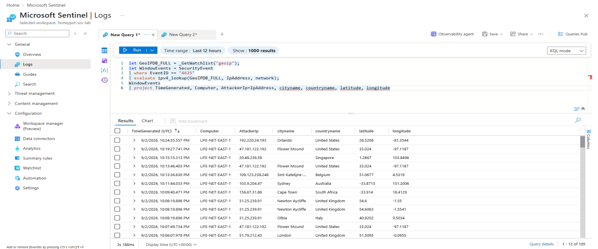

*Geolocation lookup query and results*

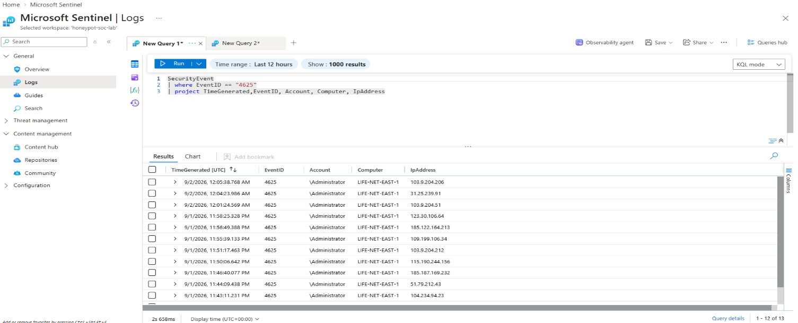

*Failed logon events with attacker IP addresses*

Before integrating the watchlist, the raw security event logs had no location information at all, just IP addresses. After this query, each event carried city and country data alongside it.

## 10. Building the Attacker Map

With location data resolvable, the last step was visualizing it. I built this using a Sentinel workbook:

```text
Sentinel → Workbooks → Add workbook → Edit
(removed the default template elements)
→ Add query → Advanced Editor
→ pasted in the geoip-based query as JSON
→ saved
```

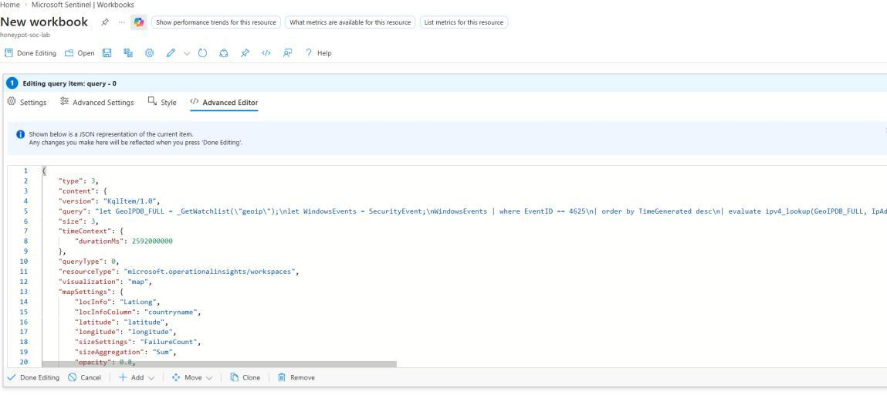

*Building the map query in the workbook's Advanced Editor*

This turns raw log rows into a live map showing every attacker's approximate location, updating as new failed logons and geolocation matches come in.

## 11. Results

I left the VM running for 24 hours to see what it would attract. In that window:

- The map showed a real spread of attacker locations from around the world hitting the VM.
- The brute force detection rule fired, and an incident was created in Sentinel from it, confirming the detection logic actually worked against real attack traffic, not just test data.


*Live attacker map after 24 hours: attacks from Vietnam, the US, South Africa, Malaysia, India, the UK, Italy, and more*


*The brute force detection rule fired, generating a real incident*

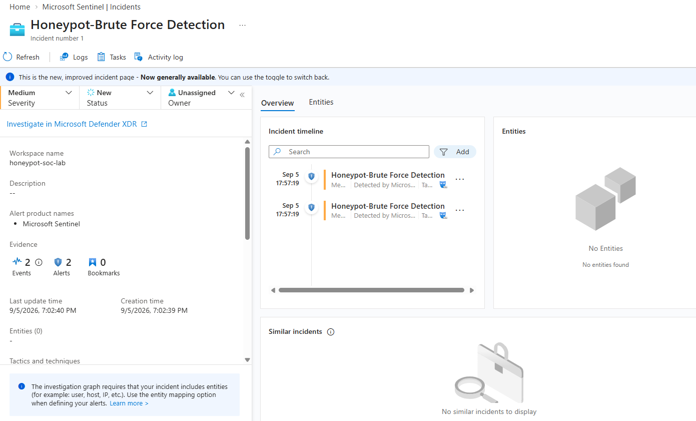

*Incident detail view for the Honeypot - Brute Force Detection rule*

I didn't investigate that incident in depth here, since deep incident investigation was outside the scope of this particular lab (that's more the shape of my Macro-ni-style investigation work). But having a real, organically-triggered incident is solid proof that the detection pipeline works end to end.

## 12. What This Project Taught Me

- **Exposure has consequences you can measure.** It's one thing to know a system on the open internet gets attacked; it's another to watch it happen in real time on a map within hours of opening the firewall.
- **A honeypot is only as useful as its logging.** None of the detection rules mean anything without the Log Analytics Workspace, Azure Monitor Agent, and Data Collection Rule correctly wired up first. Getting the pipeline right came before writing a single detection query.
- **Severity should reflect confidence, not just technique.** A failed login is Medium. A cleared log is High. The technique matters, but so does how strongly the behavior implies something bad actually happened.
- **Detections have blind spots, and that's worth documenting, not hiding.** The event-log-cleared rule can be evaded by an attacker who clears logs fast enough. Writing that down honestly is more valuable than pretending the rule is airtight.
- **Geolocation data adds context, not proof.** An IP resolving to a city doesn't confirm where an attacker physically is. It's a useful signal, not a conclusion.

## 13. Summary

I built a honeypot in Azure by creating a resource group, virtual network, and VM, then deliberately exposed it by opening the network security group to all inbound traffic and disabling the VM's internal firewall. I set up a Log Analytics Workspace connected to Microsoft Sentinel, and used the Azure Monitor Agent with a Data Collection Rule to forward Windows security logs into that workspace. After confirming logs were flowing, I built four detection rules covering brute force login attempts, suspicious processes launched right after login, new local user account creation, and event log clearing, mapped respectively to the Credential Access, Execution, Persistence, and Defense Evasion MITRE ATT&CK tactics. I then integrated a geolocation watchlist to resolve attacker IP addresses to real-world locations and built a Sentinel workbook to visualize those attacks on a live map. After leaving the VM exposed for 24 hours, real attack traffic from around the world triggered the brute force detection rule and generated an actual incident, confirming the detection pipeline worked against genuine, unsimulated attacks.

## 14. Resources

- [Microsoft Sentinel documentation](https://learn.microsoft.com/en-us/azure/sentinel/)
- [Microsoft Azure Network Security Group documentation](https://learn.microsoft.com/en-us/azure/virtual-network/network-security-groups-overview)
